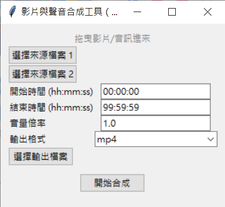

# 🎬 VidMerge GUI

一款簡單易用的影片與音訊合併工具，幫你快速搞定「高畫質影片影音分離」的困擾。



---

## 功能特色

- **拖曳操作**：將影片與聲音檔直接拖進來就能開始合併  
- **可裁剪片段**：輸入起始與結束時間，自訂要保留的區段  
- **音量調整**：可放大或縮小聲音音量  
- **格式選擇**：支援 mp4、mkv、mp3  
- **自訂輸出位置與檔名**  
- **快速合併**：底層使用 FFmpeg 處理，不影響畫質與效能  

---

## 使用情境

> 有時候下載到畫質高的影片卻沒有聲音，或者影片與聲音是分開的兩個檔案。  
> 傳統需要手動輸入指令、對時間軸、選輸出格式，麻煩又容易出錯。  
>  
> **VidMerge GUI** 幫你把這些流程變成圖形化操作，快速合成影片與音訊，  
> 不需要會寫程式或剪輯！

---

## 使用方式

### 安裝依賴

1. 安裝 [Python](https://www.python.org/)（建議 Python 3.10+）  
2. 安裝 [ffmpeg](https://ffmpeg.org/) 並加入系統環境變數  
3. 安裝套件：

```bash
pip install -r requirements.txt
```

---

### ▶️ 執行程式

```bash
python main.py
```

或使用 `.exe` 執行檔（注意：檔案較大）

---

## 技術細節

- 語言：Python  
- GUI 框架：Tkinter  
- 背後處理：呼叫 FFmpeg 指令行  

### 合成邏輯：

- 使用 `-shortest` 以最短長度為準合併  
- 聲音與畫面不需手動對齊  
- 使用者介面封裝常用選項，避免寫指令  

---

## 專案結構（簡略）

```
VidMerge-GUI/
├── main.py        # 主程式
├── vidmerge_gui.py         # 功能
├── screenshot.png          # 介面截圖
├── vidmerge_gui.spec       #打包exe時可用
└── README.md
```

---


## 製作初衷

這個小工具原本只是為了解決自己下載影片沒有聲音的困擾。  
後來乾脆做成 GUI 版，希望也能幫助到有同樣需求的人。

歡迎試用、改作、分享 

